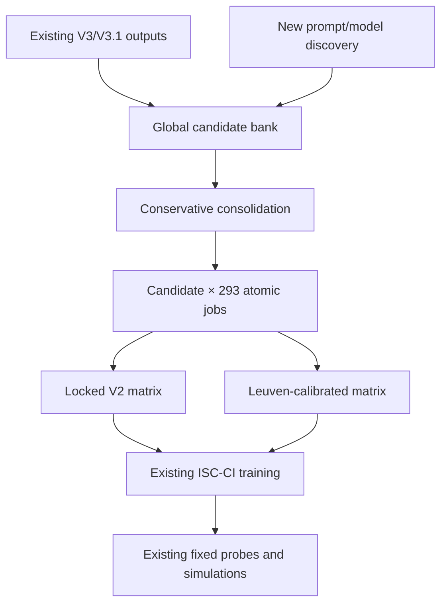

# PRD: V4 High-Recall Feature Discovery and Atomic Completion for ISC-CI

## 1. Executive summary

V4 combines the strongest parts of the existing pipelines:

1. Use V3-style free generation to discover a broad vocabulary of candidate semantic features.
2. Pool candidates across words, prompts, generation rounds, and models.
3. Conservatively consolidate proposition-equivalent phrases.
4. Use the existing V2 atomic-judgment pipeline to judge every candidate feature for every Leuven word.
5. Retain features that apply to enough objects to form valid ISC-CI contexts.
6. Train ISC-CI with the same architecture, frozen semantic embeddings, episode sampler, optimizer, training duration, seeds, probes, and paper simulations used in the completed V2/V3/V3.1 validation.

The key operation is global completion. If free generation produces `has a handle` for *hammer* but not *mug*, the atomic stage must still judge `has a handle` for all 293 Leuven objects. V4 therefore uses generation only to nominate candidate dimensions. Generation frequency does not determine the final object-by-feature matrix.

V4 is designed to answer two separable questions:

- **Does atomic judgment improve a fixed generated vocabulary?** Compare V3.1-B with V4 applied only to the V3.1-B candidate vocabulary.
- **Does broader discovery add useful semantic dimensions?** Compare that fixed-vocabulary V4 condition with V4 using the pooled high-recall candidate bank.

Implementation must leverage the completed code. V4 should be a thin orchestration and adaptation layer over:

- `leuven_expansion.generate_features` and `revalidate_generations`;
- `consolidate_v3.py` and its audit/manual-review machinery;
- the V2 feature schema, prompt, judge, adjudication, job, resume, and validation modules;
- `run_validation.py`, `evaluate_validation.py`, `run_paper_simulations.py`, and the existing `iscci_validation` package.

Do not create a parallel generation client, a new atomic judge, a new ISC-CI implementation, or a separate evaluation framework.

## 2. Motivation

The completed experiments show complementary strengths and weaknesses:

| Condition | Main strength | Main limitation |
| --- | --- | --- |
| V2 atomic judgments | Human input-object geometry `r = .821`; positive recall `.864` | Precision `.232`; matrix density `26.6%` versus `7.1%` human |
| V3.1-B generation | 175 retained contexts; input geometry improved to `.241`; in-domain similarity `r = .534` | Sparse matrix (`2.4%`); limited vocabulary and completion; outside human run-to-run variation |
| Human norms | Reference geometry and model behavior | Expensive and difficult to extend |

V3.1-B shows that better prompting can expand the recurring feature vocabulary, but it still estimates spontaneous production rather than feature applicability. V2 shows that atomic judgments recover substantial human structure, but its locked `nonzero = present` decision rule over-endorses features.

V4 tests whether these problems can be separated:

- free generation supplies high-recall candidate dimensions;
- atomic judgments prune invalid source associations and complete valid associations for objects that did not spontaneously produce the feature;
- calibration controls V2-style over-endorsement without using ISC-CI or false-memory outcomes.

## 3. Product goal

Produce an auditable V4 object-by-feature matrix and a matched set of ISC-CI models that reveal whether high-recall LLM discovery plus exhaustive atomic applicability judgments better recovers human semantic geometry and downstream ISC-CI behavior than either V2 or V3.1 alone.

## 4. Scientific questions

### 4.1 Primary question

Does exhaustive atomic completion of a broad, LLM-discovered feature vocabulary improve the human similarity of the 293-object semantic geometry relative to V3.1-B?

### 4.2 Mechanism questions

1. Holding the V3.1-B vocabulary fixed, how much do pruning and completion improve the matrix?
2. After atomic completion is held fixed, how much does pooling candidates across prompts, rounds, and model families improve the matrix?
3. Are gains driven by a larger number of redundant feature wordings or by genuinely new semantic dimensions?
4. Does calibration reduce false-positive density while preserving the coverage that made V2 useful?

### 4.3 Downstream questions

1. Does V4 improve inferred-context and context-dependent activation geometry?
2. Does it improve the rank ordering of membership logits?
3. Does it preserve or improve the published induction, similarity, asymmetry, thematic, and context-dependent simulations?
4. Does the expanded vocabulary increase usable coverage for false-memory stimuli without distorting behavior on the original Leuven vocabulary?

## 5. Non-goals

V4 will not:

- claim to reproduce the Leuven participant task exactly;
- treat generation frequency as a human feature norm;
- use existing Leuven feature labels to prompt candidate discovery;
- select prompts, models, thresholds, or consolidation rules using ISC-CI or false-memory results;
- replace human norms merely because V4 contains more features;
- retrain the frozen semantic encoder for the same 293 Leuven words;
- rewrite the released ISC-CI architecture or training procedure;
- use confidence, model identity, generation frequency, or provenance as ISC-CI input features;
- prune candidates with embeddings or retrieval in the primary exhaustive condition;
- mix prompt conditions before preserving source-specific ablations.

Extension to new words that lack the frozen 64-dimensional semantic embeddings is a separate project. V4 first validates the feature-discovery and completion mechanism on the existing 293-word vocabulary.

## 6. Core design principles

### 6.1 Generation nominates; judgment determines applicability

A generated word-feature association enters the candidate bank, but it is not automatically a positive cell. The atomic panel independently decides the feature's applicability to every Leuven word.

### 6.2 Candidate vocabulary is global

Every eligible candidate is crossed with every one of the 293 Leuven words. The judge must not see which word originally generated the feature.

### 6.3 Breadth is measured before downstream modeling

Candidate count, rarefaction, source diversity, Leuven-feature rediscovery, and feature-category coverage must be computed before ISC-CI results are inspected.

### 6.4 Primary execution is exhaustive

All frozen candidate features must be judged for all 293 words. Staged execution and sharding are allowed, but candidate pruning based on semantic similarity to a target word is not part of the primary condition.

### 6.5 Existing stages remain immutable controls

Previously completed V2, V3, V3.1, human-retrained, and released-checkpoint artifacts are read-only. V4 imports or references them and adds only new conditions.

### 6.6 Separate exact reuse from recommended calibration

V4 must produce both:

- a locked-rule condition using the executed V2 rule, where resolved values `1–4` are present and `0` is absent;
- a calibrated condition using a threshold chosen only from existing V2 judgments against human Leuven cells.

The locked-rule condition isolates the effect of applying the existing V2 procedure to a generated vocabulary. The calibrated condition is the recommended production V4 model because current V2 results show severe over-endorsement.

## 7. Required experimental conditions

### 7.1 Existing reference conditions

Reuse without retraining when hashes match:

- `RELEASED_HUMAN`
- `HUMAN_RETRAIN`
- `V2_ORIGINAL_SCHEMA`
- `V3_A`, `V3_B`, `V3_C`
- `V3_1_A`, `V3_1_B`, `V3_1_C`

### 7.2 New fixed-vocabulary conditions

Use exactly the 175 consolidated contexts retained in the completed V3.1-B condition, with the same canonical labels, order, and inventory hash:

- `V4_B_LOCKED_V2`
- `V4_B_CALIBRATED`

These conditions isolate pruning and completion from increased vocabulary breadth.

Do not add V3.1-B singletons or subthreshold clusters to these two conditions. Those candidates may enter the pooled ensemble bank, but adding them to `V4_B_*` would break the fixed-vocabulary control.

Represent the 175-context inventory as a hashed subset of the pooled candidate system. When a V3.1-B context is also present in the ensemble bank, reuse the same completed atomic cells; do not judge it a second time under a different condition label.

### 7.3 New pooled-vocabulary conditions

Use the union of all frozen V4 discovery sources:

- `V4_ENSEMBLE_LOCKED_V2`
- `V4_ENSEMBLE_CALIBRATED`

These conditions test the full V4 process.

### 7.4 Required matrix-only ablations

These do not require ISC-CI training unless resources allow:

- `V4_ENSEMBLE_SOURCE_ONLY`: retain a judged positive only when the object generated the candidate at least once. This quantifies the value of completion.
- `V4_ENSEMBLE_UNCALIBRATED_RAW`: preserve resolved 0–4 values for calibration and error analysis.
- `V4_ENSEMBLE_NO_SEMANTIC_MERGE`: use only safe lexical normalization to quantify sensitivity to candidate consolidation.
- `V4_BY_SOURCE`: reconstruct matrices cumulatively by prompt, round, and model source to produce rarefaction and marginal-yield curves.

### 7.5 Optional judge-robustness condition

On a preregistered stratified subset of cells, rerun the same atomic rubric with an independent model family. This is a robustness analysis, not part of the primary V4 matrix. It tests whether generator-judge family overlap creates correlated errors.

## 8. Pipeline overview



## 9. Stage A: high-recall feature discovery

### 9.1 Reuse existing generations first

The initial candidate bank must import, without new model calls:

```text
artifacts/leuven_feature_generation/leuven_v3_qwen2_5_72b/generated_features_long.csv
artifacts/leuven_feature_generation/v3.1/leuven_v3.1_qwen2_5_72b/generated_features_long.csv
```

Use the associated manifests to verify:

- model revision;
- prompt hashes;
- word inventory and order;
- response counts;
- sampling seeds;
- parse-error status;
- source-file hashes.

V3 and V3.1 prompts remain distinct provenance sources even after their candidates are pooled.

### 9.2 New discovery prompt families

New calls should use `leuven_expansion.generate_features`, its existing JSON schema, retry logic, seed logic, cache behavior, manifests, and raw-output preservation.

Add prompt texts through configuration rather than forking the generation code. The high-recall prompt ensemble should include:

| Prompt family | Intended contribution |
| --- | --- |
| First-to-mind anchor | Preserve comparability with V3.1-B |
| Perceptual and structural | Shape, color, size, material, parts, texture, sound |
| Functional and affordance | Uses, actions, manipulation, goals, effects |
| Taxonomic and definitional | Kind, category, contrast class, necessary properties |
| Situational and relational | Locations, agents, co-occurrences, social or thematic relations |
| Encyclopedic and causal | Origins, mechanisms, typical consequences, background knowledge |
| Less-obvious but general | Valid properties omitted by first-to-mind generation |

Every prompt must:

- receive one stimulus word only;
- request at most ten short feature propositions;
- avoid Leuven labels, other target words, categories, and downstream outcomes;
- use the existing structured output contract;
- preserve independent calls and raw responses;
- record `prompt_family`, `prompt_hash`, `model_id`, `model_revision`, `round`, `replicate`, and `sampling_seed`.

### 9.3 Generation rounds

#### Round 0: existing independent generations

Import V3 and V3.1.

#### Round 1: independent breadth prompts

Run each new prompt independently with 20 responses per word. Use paired seeds across prompt families where supported.

#### Round 2: optional gap-filling

After Round 1 is frozen, a gap-filling call may receive the same word plus a compact list of already discovered features for that word and request additional non-equivalent properties. This round is explicitly a candidate-discovery intervention, not a simulated independent participant.

Gap-filling outputs must be labeled separately and may not contribute to production-frequency analyses.

### 9.4 Model-source tranches

Use configurable, frozen model IDs rather than hard-coding provider aliases in analysis code.

Recommended tranches are:

1. Existing Qwen2.5-72B-Instruct generations.
2. A newer open-weight model in the same family.
3. A strong open-weight model from an independent family.
4. One fixed-snapshot frontier proprietary model as a ceiling condition.

All models use the same prompt texts and output schema where possible. Unsupported sampling parameters are recorded as part of the model condition. The objective is vocabulary coverage, not a model leaderboard.

### 9.5 Raw generation outputs

Retain the existing files per generation job:

```text
feature_generations.csv
generated_features_long.csv
generated_feature_frequencies.csv
parse_errors.csv
manifest.json
run.log
```

Do not overwrite or merge raw jobs. Pool only from validated, manifest-linked derived tables.

### 9.6 Discovery saturation

Compute rarefaction curves over:

- responses per word: 5, 10, 15, 20;
- prompt families;
- generation rounds;
- model sources;
- consolidated candidate propositions;
- candidates that survive atomic judgment and ISC-CI's object-frequency rule.

Source-order curves must be recomputed under multiple randomized source orders so a favorable ordering does not determine marginal yield.

## 10. Stage B: candidate-bank construction

### 10.1 Input unit

The input is one normalized feature phrase from one preserved generation response. Each row must retain its source word and all generation provenance.

### 10.2 Reuse the existing consolidation implementation

Extend `consolidate_v3.py` through configuration or a thin wrapper so it can:

- read multiple `generated_features_long.csv` inputs;
- preserve prompt/model/round provenance;
- pool sources for candidate discovery;
- export candidates before the V3 `response_count > 3` cutoff;
- use the existing lexical normalization, embedding comparison, object-profile comparison, complete-link clustering, and audit tables;
- apply manual review decisions before final candidate IDs are frozen.

Do not copy consolidation functions into a new package.

### 10.3 High-recall inclusion rule

The primary V4 bank includes every valid consolidated proposition, including valid singletons. Do not apply V3's `response_count > 3` or `positive_objects > 3` filters before atomic judging.

Only structural exclusions are allowed:

- empty or malformed phrases;
- model commentary rather than a feature proposition;
- exact duplicates after safe normalization;
- undecodable text that cannot be presented to the judge;
- a phrase rejected during documented proposition-equivalence review.

Rare features may later fail ISC-CI's post-judgment `positive_objects > 3` context rule. They must not be removed merely because they were rarely generated.

### 10.4 Conservative equivalence rule

Two phrases may share a candidate ID only when they express the same proposition, not merely when they occur for similar objects.

Preserve distinctions involving:

- modality: `can`, `must`, `usually`, `sometimes`;
- frequency;
- negation;
- conjunction versus disjunction;
- direction or argument role;
- substantive modifiers;
- taxonomic level;
- part versus material versus use.

The existing embedding and object-profile similarities nominate possible merges. They do not authorize merges. Every nontrivial merge that would enter the judged candidate bank requires a recorded approval. When uncertain, keep phrases separate.

### 10.5 Stable candidate IDs

Create IDs from a versioned canonical representation, not row number or file order. A candidate inventory must contain:

```text
candidate_id
canonical_feature_text
member_phrases
source_words
source_prompt_families
source_models
source_rounds
n_independent_responses
n_source_words
n_source_models
normalization_version
merge_review_status
candidate_inventory_hash
```

### 10.6 Human-feature mapping is evaluation-only

After the candidate bank is frozen, map candidates to the 385 retained human Leuven features and, secondarily, the 1,995 raw Leuven feature columns.

This mapping is used only to measure:

- exact and semantic rediscovery;
- missing human feature classes;
- redundant rediscoveries;
- novel candidate classes.

It must not be used to add candidates, delete candidates, change candidate wording, construct judgments, or select the atomic threshold.

### 10.7 Required bank outputs

```text
candidate_bank.csv
candidate_bank_v3_1_b_175.csv
candidate_phrase_assignments.csv
candidate_merge_candidates.csv
candidate_merge_review.csv
candidate_source_summary.csv
candidate_human_feature_mapping.csv
candidate_rarefaction.csv
candidate_bank_manifest.json
```

## 11. Stage C: atomic applicability judgments

### 11.1 Full cross-product

For `C` frozen candidates and `W = 293` Leuven words, create exactly:

```text
C × W
```

unique atomic cells.

Each cell is judged through the executed V2 pipeline. If the panel uses three first-pass prompts, the planned first-pass call count is:

```text
3 × C × 293
```

plus adjudication calls. A dry-run cost report must be generated before cluster submission.

### 11.2 Reuse the V2 implementation

Reuse these modules and behaviors unchanged:

```text
leuven_expansion/feature_schema.py
leuven_expansion/feature_prompts.py
leuven_expansion/feature_judge.py
leuven_expansion/feature_adjudicate.py
leuven_expansion/normalize.py
leuven_expansion/run_jobs.py
```

The only required adaptation is a schema adapter that supplies the frozen V4 candidate bank in place of the fixed Leuven feature list. The adapter must use the same `feature_id` and `feature_text` interface expected by the current judge.

### 11.3 Independence contract

Each call receives only:

- one target word;
- one candidate ID;
- one candidate feature text;
- the existing V2 applicability rubric and output schema.

The judge must not receive:

- the source word that generated the candidate;
- generation frequency;
- prompt, round, or model provenance;
- other candidate features;
- other target words;
- human Leuven values;
- DRM list or lure identity;
- ISC-CI predictions or behavioral results;
- previous judge responses or invalid outputs.

### 11.4 Exact panel and adjudication behavior

Use the frozen V2 prompt files, model revision, temperature, top-p, JSON schema, retry count, disagreement rules, adjudication prompt, and resolution function from the successful V2 run manifest.

Do not redesign the prompts during V4. A prompt revision would be V4.1 and must be evaluated separately on held-out Leuven cells before production use.

### 11.5 Sharding and resume

Infrastructure may shard jobs by stable hashes of `candidate_id × normalized_word`. Sharding must not change prompt text, sampling, adjudication, or aggregation.

Required behavior:

- deterministic job IDs;
- no duplicate completed cells;
- append-only raw votes and parse errors;
- idempotent resume;
- manifest validation before reusing a cell;
- cell-level retries without conversational history;
- final completeness check against the frozen cross-product.

### 11.6 Atomic outputs

```text
feature_votes.csv
feature_adjudication_votes.csv
resolved_feature_values.csv
unresolved_cells.csv
parse_errors.csv
judgment_manifest.json
run.log
```

`resolved_feature_values.csv` must contain:

```text
candidate_id
target_word
resolved_value
resolved_binary_locked_v2
confidence
ambiguous
resolution_method
needs_human_audit
vote_prompt_hashes
judge_model_revision
```

No unresolved cell may enter a primary matrix.

## 12. Stage D: calibration

### 12.1 Why calibration is required

The executed V2 rule treats every resolved nonzero value as present. That condition recovered high human recall but produced `.232` precision and a `26.6%` positive matrix. V4 must preserve this rule as a control, but it should not assume that the rule is optimal for a much larger candidate vocabulary.

### 12.2 Calibration data

Reuse the completed V2 judgments for the 293 Leuven objects and 385 retained human features. Do not rerun those calls.

Define the human binary target using the same human preprocessing used by the current ISC-CI validation. Preserve the exact locked target construction and hashes.

First verify that the V2 artifacts retain the resolved ordinal values on the original 0–4 scale. If they do not:

1. reconstruct them from preserved raw votes and adjudications using the existing V2 resolver;
2. verify the reconstruction against every retained binary V2 cell; and
3. only if reconstruction is impossible, rerun the original 293-by-385 V2 cells with the frozen V2 manifest.

Never invent ordinal scores from the binary matrix. If neither reconstruction nor an exact-manifest rerun is possible, omit `V4_*_CALIBRATED`, retain the locked-rule conditions, and report calibration as blocked.

### 12.3 Calibration split

Use five-fold splits by word, not random cells, so all cells for a held-out word remain together.

For thresholds over the resolved V2 scale, report on held-out folds:

```text
positive_precision
positive_recall
positive_f1
balanced_accuracy
MCC
matrix_density
word_vector_cosine
input_object_RDM_correlation
```

### 12.4 Threshold-selection rule

Before inspecting any V4 ISC-CI results:

1. Restrict candidate thresholds to deterministic cuts on the resolved V2 value.
2. Select the threshold with the highest cross-validated MCC subject to positive recall of at least `.80`.
3. Break ties by higher precision, then the more conservative threshold.
4. If no threshold meets the recall constraint, select the highest-MCC threshold and mark the recall gate as failed.
5. Freeze the selected rule in `judgment_threshold.json`.

The current locked V2 rule is always retained as a separate condition even if calibration selects the same threshold.

### 12.5 Prohibited calibration inputs

Do not use:

- V4 candidate-source frequencies;
- candidate-to-human phrase mappings;
- ISC-CI activations or losses;
- induction or similarity simulations;
- DRM coverage or false-memory outcomes;
- manual threshold adjustments after viewing V4 results.

## 13. Stage E: V4 matrix construction

### 13.1 Raw matrix

Create one 293-object by `C`-candidate matrix from `resolved_value`. Preserve the raw 0–4 value even when the primary ISC-CI loader uses binary targets.

### 13.2 Locked V2 binary matrix

Use the executed rule:

```python
present = resolved_value > 0
```

### 13.3 Calibrated binary matrix

Apply the frozen calibration rule from `judgment_threshold.json` without refitting.

### 13.4 Post-judgment context retention

Apply ISC-CI's existing task rule to each binary condition:

```python
retain_candidate = positive_object_count > 3
```

This is a strict inequality. It occurs after exhaustive atomic judgment. Do not apply the V3 `response_count > 3` rule to V4.

### 13.5 Source-only ablation

For each candidate-object cell, record whether that object generated any member phrase. The source-only matrix masks completed positive cells for objects that never generated the candidate.

Report:

```text
source_positive_cells
source_cells_pruned_by_judges
new_cells_added_by_completion
completion_to_source_ratio
positive_objects_per_candidate_before_and_after_completion
contexts_gained_or_lost_after_judging
```

### 13.6 Redundant context control

After judgment, identify candidate pairs with identical or near-identical object profiles. Do not automatically merge them without a documented decision rule. A merge requires both:

- proposition equivalence; and
- a documented review decision, which may be an automated threshold-based
  decision consistent with the precedent set by the frozen V3.1-B
  consolidation (`embedding_similarity_threshold=0.85`, see
  `ISC-CI_LLM_validation/artifacts/v3_1_consolidation/threshold_sensitivity.csv`),
  rather than a per-cluster human check. `build_v4_candidate_bank.py
  --auto-approve-merges` applies this rule and records
  `reviewer=automated:embedding_threshold` for every such decision so it
  remains auditable; any verdict a human reviewer has already entered in
  `configs/v4_candidate_merge_review.csv` is never overridden.

Report results with the primary reviewed bank and a no-semantic-merge sensitivity bank. This prevents duplicated phrasings from artificially overweighting one semantic dimension.

### 13.7 Required matrices

```text
matrices/v4_b_raw.csv
matrices/v4_b_locked_v2.csv
matrices/v4_b_calibrated.csv
matrices/v4_ensemble_raw.csv
matrices/v4_ensemble_locked_v2.csv
matrices/v4_ensemble_calibrated.csv
matrices/v4_ensemble_source_only.csv
matrices/cell_provenance.parquet
matrices/context_inventory_comparison.csv
```

### 13.8 Validation failures

Fail before ISC-CI training if:

- the candidate-bank hash differs from the judgment manifest;
- any of the `C × 293` cells is missing or duplicated;
- any primary cell is unresolved;
- any resolved value falls outside the V2 schema;
- a feature or word is aligned by row position rather than stable ID;
- the calibration file was created after downstream evaluation artifacts;
- the strict `positive_object_count > 3` rule changes;
- previous V2/V3/V3.1 artifacts were modified.

## 14. Stage F: ISC-CI training

### 14.1 Reuse the completed validation code

Extend the condition registry and matrix loader used by `run_validation.py`. Do not introduce a second ISC-CI model or trainer.

Reuse exactly:

- the frozen 64-dimensional context-independent embeddings;
- model architecture and nonlinearities;
- context and query pathways;
- episode sampler;
- loss terms and weights;
- optimizer and learning rate;
- executed batch size of 128;
- 1,024 episodes per epoch;
- 400 epochs, or 409,600 sampled episodes;
- training seeds `0,1,2,3`;
- checkpoint and metric formats.

### 14.2 Why semantic retraining is not part of V4

All primary V4 models use the same 293 Leuven words already represented by the frozen semantic encoder. Candidate features define context tasks; they do not require new item embeddings. Retraining the semantic encoder would add an unnecessary source of variation and would no longer match the completed V3/V3.1 control.

### 14.3 Checkpoint reuse

Import existing reference checkpoints only when condition name, matrix hash, semantic-embedding hash, training parameters, code revision, and seed match. Train only the four seeds for each new V4 condition.

### 14.4 Training manifest

Every checkpoint must record:

```text
condition
matrix_hash
candidate_bank_hash
judgment_manifest_hash
calibration_hash
semantic_embedding_hash
training_config_hash
source_commit
seed
epochs
episodes
executed_batch_size
```

## 15. Stage G: evaluation

### 15.1 Reuse fixed evaluation probes

Use the exact probes from the completed validation:

- all 293 singleton supports;
- 1,024 fixed unordered support pairs;
- all 293 real query objects;
- 512 fixed contexts for context RDMs;
- 128 fixed contexts for context-dependent RDMs;
- evaluation seed `20260804`;
- the existing word and context ordering files.

Do not resample probes for V4.

### 15.2 Input-level primary outcome

For each object-by-feature matrix:

1. Compute pairwise object cosine similarities within that matrix.
2. Convert them to an object RDM.
3. Correlate the upper triangle with the human object RDM using Spearman correlation.

This comparison is valid across different feature vocabularies because it compares within-condition object relations rather than aligning feature columns.

### 15.3 Required representational outcomes

Reuse `evaluate_validation.py` and `iscci_validation/evaluation.py` to compute:

- context RDM Spearman correlation;
- median context-dependent RDM Spearman correlation;
- membership-logit Spearman correlation;
- binary membership agreement;
- membership-probability MAE;
- nearest-neighbor overlap;
- context-induced representational shifts.

### 15.4 Activation cosine comparisons

Within each model, cosine similarity matrices may be computed directly from activations for the same fixed queries.

Across independently trained models, do not compare hidden-unit vectors with raw cosine similarity because unit permutation and rotation are arbitrary. Use:

- RDM/RSA comparisons as the primary activation analysis;
- orthogonal Procrustes alignment fit on alignment-train queries for direct activation comparisons;
- held-out queries for aligned cosine similarity and residual error.

### 15.5 Paper simulations

Run the unchanged `run_paper_simulations.py` suite:

- five induction datasets;
- seven induction phenomena;
- nine in-domain similarity datasets;
- asymmetric similarity;
- thematic paired choices;
- context-dependent paired choices;
- similarity-context LCA with the existing simulation count, steps, burn-in, and stable seeds.

### 15.6 Coverage outcomes

Before extending training to new words, report:

- proportion of 385 retained Leuven features rediscovered;
- rediscovery by perceptual, functional, taxonomic, encyclopedic, and relational classes;
- number of judged V4 contexts not mapped to a retained Leuven feature;
- number of new contexts with more than three positive Leuven objects;
- rarefaction of retained contexts across prompts, rounds, models, and responses;
- marginal human-RDM gain from each discovery tranche after atomic completion.

### 15.7 False-memory extension gate

Only after V4 passes the Leuven validation gates may the frozen candidate bank and atomic pipeline be applied to additional DRM items.

For each new item:

- reuse the same candidate IDs and judge prompts;
- judge all retained V4 candidates exhaustively;
- do not expose list membership, critical-lure role, associative strength, or outcomes;
- preserve original Leuven rows and contexts;
- use the existing false-memory coverage and simulation code.

## 16. Statistical analysis

### 16.1 Primary contrasts

1. `V4_B_CALIBRATED − V3_1_B`: effect of atomic pruning and completion for a fixed vocabulary.
2. `V4_ENSEMBLE_CALIBRATED − V4_B_CALIBRATED`: effect of broader candidate discovery.
3. `V4_ENSEMBLE_CALIBRATED − V2_ORIGINAL_SCHEMA`: generated vocabulary versus human-seeded vocabulary under atomic judgment.
4. `V4_ENSEMBLE_CALIBRATED − HUMAN_RETRAIN`: remaining gap to human data.

### 16.2 Mandatory control contrasts

- calibrated versus locked V2 threshold;
- full completion versus source-only masking;
- reviewed consolidation versus no-semantic-merge bank;
- each V4 condition versus the human retraining self-ceiling.

### 16.3 Uncertainty

Use:

- bootstrap over objects for input-object RDM and nearest-neighbor metrics;
- bootstrap over fixed contexts for context and context-dependent RDMs;
- all 16 candidate-seed by human-seed comparisons;
- paired training seeds when comparing V4 conditions;
- bootstrap over discovery responses and source tranches for vocabulary rarefaction;
- permutation tests that shuffle object labels for RDM significance.

Report estimates and 95% intervals. Do not treat the four training seeds as four independent datasets.

### 16.4 No downstream selection

Prompt families, candidate inclusion, merge decisions, atomic prompt versions, and calibration must be frozen before downstream models are compared. Paper-simulation outcomes may evaluate V4 but may not select the V4 matrix.

## 17. Provisional success criteria

Freeze final numerical gates before production judging begins.

### 17.1 Pipeline validity

- 100% of the frozen candidate-by-word cross-product resolved or explicitly audited.
- Parse/schema failure rate at or below 1% before retry and 0% unresolved in primary matrices.
- Existing V2/V3/V3.1 tests remain green and their artifact hashes remain unchanged.
- Golden human and released-checkpoint comparisons remain within the approved reproduction range.

### 17.2 Atomic calibration

- Held-out-word positive recall at least `.80`, or a documented failure of the constraint.
- Precision and MCC improve over the locked V2 rule.
- Calibration reduces matrix-density inflation without using downstream outcomes.

### 17.3 Fixed-vocabulary V4 success

`V4_B_CALIBRATED` should:

- exceed V3.1-B's human input-object RDM correlation of `.241` with a positive bootstrap interval for the paired difference;
- improve at least one of context-dependent RDM or membership-rank correlation without materially worsening the other;
- show that completion, not merely source-word pruning, accounts for a meaningful share of the gain.

### 17.4 Full V4 success

`V4_ENSEMBLE_CALIBRATED` should:

- outperform `V4_B_CALIBRATED` on human input-object geometry;
- retain more nonredundant, applicable contexts than V3.1-B's 175;
- increase human-feature rediscovery across more than one feature class;
- not reduce context-dependent RDM or membership-rank correlation by more than `.02` relative to `V4_B_CALIBRATED`;
- preserve qualitative conclusions across consolidation and threshold sensitivities.

### 17.5 Strong replacement evidence

V4 would support a stronger replacement claim only if input geometry, context-dependent geometry, membership ordering, and behavioral simulations all approach the human retraining distribution. A larger feature inventory or higher binary agreement alone is insufficient.

## 18. Existing-code reuse map

| V4 stage | Existing implementation to reuse | Permitted V4 change |
| --- | --- | --- |
| Free generation | `leuven_expansion.generate_features` | Configurable prompt/model lists and round metadata |
| Offline parse repair | `leuven_expansion.revalidate_generations` | Point at new job directories |
| Consolidation | `consolidate_v3.py` | Multi-source input and pre-threshold candidate export |
| Consolidation audit | `audit_consolidation_rules.py` | Add V4 bank and source-stratified summaries |
| Feature schema | `leuven_expansion/feature_schema.py` | Adapter from frozen candidate bank |
| Atomic prompts | `leuven_expansion/feature_prompts.py` | No primary change |
| Atomic requests | `leuven_expansion/feature_judge.py` | No primary change |
| Adjudication | `leuven_expansion/feature_adjudicate.py` | No primary change |
| Job execution | `leuven_expansion/run_jobs.py` | Candidate-based sharding only |
| ISC-CI training | `run_validation.py` and current trainer/model modules | Register V4 conditions and matrices |
| Fixed-context evaluation | `evaluate_validation.py`, `iscci_validation/evaluation.py` | Add comparisons and labels |
| Paper simulations | `run_paper_simulations.py` | Add V4 conditions only |
| Reporting | `summarize_results.py`, `summarize_v3_1_results.py` | Add V4 tables and contrasts |

## 19. Minimal new code

Add thin orchestration and adaptation modules only:

```text
build_v4_candidate_bank.py
run_v4_judgments.py
calibrate_v4_judgments.py
build_v4_matrices.py
summarize_v4_results.py
run_v4_pipeline.py
```

These modules should import existing functions rather than copy their logic.

Add locked configuration files:

```text
configs/v4_discovery.json
configs/v4_validation.json
configs/v4_candidate_merge_review.csv
configs/v4_human_feature_mapping_review.csv
```

Do not add a new `v4_*` package unless the current repository structure makes imports impossible. If a helper is generally useful, place it in the existing `leuven_expansion` or `iscci_validation` package with regression tests.

## 20. Required output structure

```text
artifacts/v4/
  resolved_v4_config.json
  source_hashes.json
  run_manifest.json

  discovery/
    source_inventory.csv
    candidate_bank.csv
    candidate_bank_v3_1_b_175.csv
    candidate_phrase_assignments.csv
    candidate_merge_review.csv
    candidate_human_feature_mapping.csv
    candidate_rarefaction.csv
    candidate_bank_manifest.json

  judgments/
    feature_votes.csv
    feature_adjudication_votes.csv
    resolved_feature_values.csv
    unresolved_cells.csv
    parse_errors.csv
    judgment_threshold.json
    calibration_metrics.csv
    judgment_manifest.json

  matrices/
    v4_b_raw.csv
    v4_b_locked_v2.csv
    v4_b_calibrated.csv
    v4_ensemble_raw.csv
    v4_ensemble_locked_v2.csv
    v4_ensemble_calibrated.csv
    v4_ensemble_source_only.csv
    cell_provenance.parquet
    context_inventory_comparison.csv

  validation/
    base_validation_manifest.json
    models/
    evaluation/
    paper_simulations/
    validation_manifest.json

  reports/
    V4_RESULTS.md
    v4_primary_contrasts.csv
    v4_source_marginal_yield.csv
    v4_pruning_completion.csv
    v4_calibration_report.csv
    v4_representational_metrics.csv
    v4_behavioral_metrics.csv
    report_manifest.json

  scratchpad.md
  todo.md
  run.log
```

## 21. Command-line interface

The following are new thin orchestration commands to add. They must delegate to the existing modules described above.

Paths under `artifacts/leuven_feature_expansion/final/` below are illustrative aliases for the completed V2 job. The implementation must resolve the real V2 artifact directory from its retained manifest or locked configuration and must not assume that a directory named `final` exists.

### 21.1 Build the frozen candidate bank

```bash
python build_v4_candidate_bank.py \
  --config configs/v4_discovery.json \
  --manual-review configs/v4_candidate_merge_review.csv \
  --output-dir artifacts/v4/discovery
```

### 21.2 Estimate the atomic workload

```bash
python run_v4_judgments.py \
  --candidate-bank artifacts/v4/discovery/candidate_bank.csv \
  --leuven-words data/leuven_combined_features_consolidated.csv \
  --output-dir artifacts/v4/judgments \
  --dry-run
```

The dry run must report candidate count, cell count, three-pass call count, estimated adjudication range, shard count, and existing reusable cells.

### 21.3 Run or resume atomic judging

```bash
python run_v4_judgments.py \
  --candidate-bank artifacts/v4/discovery/candidate_bank.csv \
  --leuven-words data/leuven_combined_features_consolidated.csv \
  --v2-manifest artifacts/leuven_feature_expansion/final/manifest.json \
  --output-dir artifacts/v4/judgments \
  --resume
```

### 21.4 Calibrate without downstream leakage

```bash
python calibrate_v4_judgments.py \
  --v2-resolved artifacts/leuven_feature_expansion/final/feature_validation_predictions.csv \
  --human-features data/leuven_combined_features_consolidated.csv \
  --output-dir artifacts/v4/judgments
```

### 21.5 Build matrices

```bash
python build_v4_matrices.py \
  --candidate-bank artifacts/v4/discovery/candidate_bank.csv \
  --resolved-values artifacts/v4/judgments/resolved_feature_values.csv \
  --threshold artifacts/v4/judgments/judgment_threshold.json \
  --output-dir artifacts/v4/matrices
```

### 21.6 Train only the new V4 conditions

```bash
python run_validation.py \
  --config configs/v4_validation.json \
  --output-dir artifacts/v4/validation \
  --base-validation-dir artifacts/validation_v3_1 \
  --include-v4
```

### 21.7 Evaluate and reproduce simulations

```bash
python evaluate_validation.py \
  --config configs/v4_validation.json \
  --validation-dir artifacts/v4/validation

python run_paper_simulations.py \
  --config configs/v4_validation.json \
  --validation-dir artifacts/v4/validation

python summarize_v4_results.py \
  --run-dir artifacts/v4
```

### 21.8 End-to-end resumable entry point

```bash
python run_v4_pipeline.py \
  --config configs/v4_validation.json \
  --resume
```

## 22. Testing requirements

### 22.1 Preserve the current suite

Run the full existing tests before and after V4 changes:

```bash
pytest -q tests
```

No existing test may be changed merely to accommodate different V4 behavior. If an existing invariant was wrong, document the evidence and add a regression test before changing it.

### 22.2 New tests

```text
tests/test_v4_candidate_bank.py
tests/test_v4_candidate_schema_adapter.py
tests/test_v4_judgment_jobs.py
tests/test_v4_calibration.py
tests/test_v4_matrices.py
tests/test_v4_validation_registry.py
tests/test_v4_reporting.py
tests/test_v4_end_to_end_smoke.py
```

### 22.3 Candidate-bank tests

- Multiple generation jobs load from manifests.
- Source provenance survives pooling.
- Candidate IDs are stable under input-row reordering.
- Valid singleton candidates are retained.
- The V3 response-frequency cutoff is not applied.
- Qualifiers, negation, conjunction, modality, and argument roles are preserved.
- Rejected semantic merges split before IDs freeze.
- Candidate-bank hash changes when any candidate or review changes.
- Human-feature mapping cannot mutate the bank.

### 22.4 Schema-adapter and judgment tests

- Every candidate maps to the existing atomic interface.
- Exactly one word and one candidate enter each call.
- Source provenance is absent from prompts.
- Cross-product size equals `C × 293`.
- Three first-pass votes and existing adjudication behavior are preserved.
- Stable shard assignment is independent of input row order.
- Resume skips only hash-matching completed cells.
- Invalid or mismatched IDs fail closed.

### 22.5 Calibration tests

- Splits occur by word, never random cell.
- The locked V2 rule is reproduced exactly.
- Threshold selection follows MCC, recall, precision, and conservatism tie-breaking in that order.
- The selected threshold is unchanged by V4 candidate values or downstream metrics.
- A synthetic imbalanced dataset selects the expected threshold.
- The calibration manifest predates downstream evaluation.

### 22.6 Matrix tests

- Raw, locked, and calibrated matrices share identical row and candidate order.
- Locked values equal `resolved_value > 0` exactly.
- Calibrated values match the frozen rule exactly.
- Retained contexts use strict `positive_object_count > 3`.
- Completion assigns valid positives to nonsource words.
- Source-only masking never adds a positive.
- Unresolved or duplicate cells stop the build.
- Cell provenance round-trips without loss.

### 22.7 Validation tests

- Existing checkpoints are reused only under matching hashes.
- Only V4 checkpoints are newly trained.
- Frozen semantic embeddings do not change.
- V4 performs the same 400 epochs and executed batch size as V3.1.
- Fixed evaluation contexts are byte-identical to the prior run.
- Existing paper simulations accept V4 condition labels without changed calculations.

### 22.8 Smoke tests

1. Build a bank from three words and ten candidates.
2. Create the exact 30-cell cross-product.
3. Run mock three-pass judgments and adjudication.
4. Calibrate on a synthetic human matrix.
5. Build locked and calibrated matrices.
6. Train one ISC-CI epoch on CPU.
7. Extract fixed activations and render a miniature report.

## 23. Red-to-green implementation order

1. Record current repository commit, environment, and reference artifact hashes.
2. Run and save the current full test-suite result.
3. Add failing candidate-bank tests.
4. Add multi-source and pre-threshold export options to the existing consolidation path.
5. Freeze a miniature candidate-bank fixture.
6. Add failing schema-adapter and cross-product tests.
7. Implement the thin adapter over the V2 judge.
8. Pass mock atomic-job, shard, retry, and resume tests.
9. Add failing calibration tests.
10. Implement word-fold calibration using existing V2 outputs.
11. Freeze the calibration rule before V4 downstream evaluation.
12. Add failing matrix-construction tests.
13. Build raw, locked, calibrated, and source-only matrices.
14. Add V4 conditions to the existing validation registry.
15. Pass a one-epoch end-to-end smoke run.
16. Import and hash existing V3/V3.1 candidate sources.
17. Run new generation tranches and revalidate raw outputs.
18. Freeze and review the full candidate bank.
19. Generate the full atomic workload and cost manifest.
20. Run or resume all atomic judgments.
21. Verify exact cross-product completion.
22. Build and audit all V4 matrices.
23. Train four seeds for each required V4 condition.
24. Run the unchanged fixed-context evaluation.
25. Run the unchanged paper simulations.
26. Compute source-marginal, pruning, completion, calibration, and rarefaction analyses.
27. Regenerate the complete report from manifests.
28. Run the full test suite and compare reference hashes.

## 24. Risks and mitigations

### Risk 1: Candidate explosion makes exhaustive judging expensive

**Mitigation:** Produce the dry-run call and shard manifest; execute in deterministic resumable shards; reuse all exact hash-matching judgments; run Tiered operational batches while preserving the requirement that the final primary analysis includes the entire frozen bank.

Do not silently turn a partial tranche into the full V4 result.

### Risk 2: Broad generation creates many synonymous contexts

**Mitigation:** Use conservative proposition-equivalence review, stable IDs, profile diagnostics, and a no-semantic-merge sensitivity. Never merge on object-profile similarity alone.

### Risk 3: The atomic judge over-endorses novel features

**Mitigation:** Preserve the exact V2 rule as a control and use the separately calibrated threshold as the production condition. Report density, precision, recall, and completion rates.

### Risk 4: Calibration overfits familiar Leuven words

**Mitigation:** Split by word; freeze the rule before V4 modeling; report held-out-word metrics; do not tune on candidate mappings or ISC-CI outcomes.

### Risk 5: Generator and judge share correlated errors

**Mitigation:** Hide source provenance from the judge and run an independent-family judge on a frozen stratified subset.

### Risk 6: More contexts improve apparent capacity through duplication

**Mitigation:** Report nonredundant context counts, feature-profile redundancy, reviewed versus unmerged sensitivity, and source-marginal gains after atomic completion.

### Risk 7: High context-layer similarity masks poor input geometry

**Mitigation:** Keep human input-object RDM correlation as the primary outcome. Treat context and behavioral measures as downstream validation, not substitutes.

### Risk 8: Hidden-unit rotations invalidate direct activation cosine

**Mitigation:** Use RDM comparisons primarily and Procrustes alignment with held-out queries for direct activation comparisons.

### Risk 9: New code changes previous results

**Mitigation:** Make prior artifacts read-only, import existing functions, add regression tests, require hash-matched checkpoint reuse, and fail on altered reference manifests.

## 25. Acceptance criteria

The implementation is complete when:

- existing V3/V3.1 and new discovery outputs are linked through manifests;
- a reviewed, hashed global candidate bank is frozen;
- every candidate-word cell has complete V2-format votes and resolution;
- locked and calibrated matrices are reproducible from raw judgments;
- existing V2/V3/V3.1 checkpoints and probes are reused without modification;
- four ISC-CI seeds exist for every required V4 condition;
- all fixed-context and paper-simulation outputs are complete;
- the report separates fixed-vocabulary completion from added discovery breadth;
- rarefaction, pruning, completion, calibration, redundancy, and human-feature rediscovery are reported;
- every result is traceable to source, candidate-bank, judgment, matrix, model, and evaluation hashes;
- all existing and new tests pass.

## 26. Required final report structure

`reports/V4_RESULTS.md` should contain:

1. Executive interpretation.
2. Candidate-discovery design and saturation.
3. Candidate-bank consolidation audit.
4. Atomic-judgment completeness and calibration.
5. Pruning versus completion decomposition.
6. Training matrices and density.
7. Human input-object geometry.
8. Context and context-dependent activation geometry.
9. Membership predictions.
10. Paper simulations.
11. Model/prompt/round marginal yield.
12. Sensitivity analyses.
13. Comparison with the human retraining ceiling.
14. Limitations and decision on DRM expansion.
15. Exact reproduction commands and manifest hashes.

The report must lead with whether V4 improved semantic structure, not with raw candidate count.

## 27. Methods paragraph draft

We constructed V4 feature norms in two stages. First, language models freely generated candidate semantic features for each of 293 Leuven concepts under multiple prompt families, generation rounds, and model sources. We pooled the resulting feature phrases across concepts and conservatively consolidated only proposition-equivalent variants, preserving rare and singleton candidates. Second, using the previously validated atomic feature-judgment pipeline, we independently judged every candidate feature for every Leuven concept. Each judgment contained one concept and one feature and excluded the feature's source concept, generation frequency, other features, human feature values, and downstream modeling information. We retained both the executed V2 decision rule and a threshold calibrated using held-out-word predictions for the original Leuven feature matrix. Candidate contexts applying to more than three concepts were used to train ISC-CI with the same frozen semantic embeddings, architecture, episode sampler, optimization, training duration, and seeds as the prior human, V2, V3, and V3.1 models. We evaluated recovery of human object geometry, inferred-context and context-dependent representations, membership predictions, and the original model simulations using fixed probes shared across all conditions.
